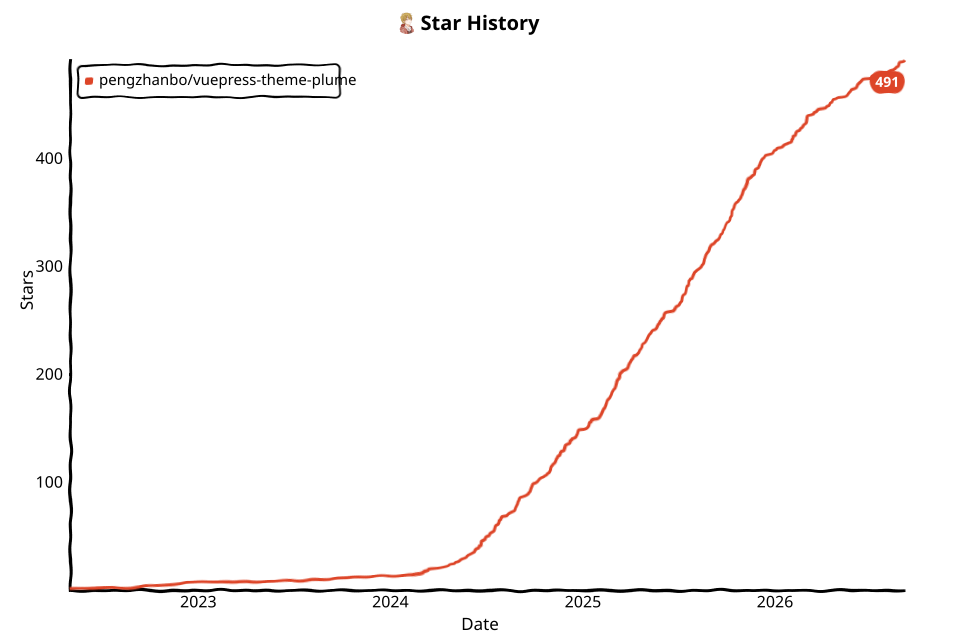

# star-history-action

English | [简体中文](README.zh-CN.md)

A GitHub Action that fetches a repository's star history and commits an
xkcd-style SVG chart back into the repository.

Here is an example of the generated chart:

<picture>
  <source
    media="(prefers-color-scheme: dark)"
    srcset="assets/example/star-history-dark.svg"
  >
  
</picture>

## Getting Started

Add the action to a workflow in the repository you want to track. The example
below refreshes the chart every day and on every push to `main`:

```yaml
name: Update star history

on:
  schedule:
    - cron: '0 0 * * *' # daily
  workflow_dispatch:

jobs:
  update:
    runs-on: ubuntu-latest
    permissions:
      contents: write
    steps:
      - uses: actions/checkout@v4
      - uses: pengzhanbo/star-history-action@v1
        with:
          repo: pengzhanbo/star-history-action
          token: ${{ github.token }}
```

> [!NOTE]
> To chart the repository that runs the workflow, you can omit `repo` — it
> defaults to the current repository (`${{ github.repository }}`).

## Scheduling updates

The action is typically driven by a `schedule` event. Configure any cron
expression you like:

| Frequency | Cron expression | Meaning                            |
| --------- | --------------- | ---------------------------------- |
| Daily     | `0 0 * * *`     | Every day at 00:00                 |
| Weekly    | `0 0 * * 1`     | Every Monday at 00:00              |
| Monthly   | `0 0 1 * *`     | On the 1st of every month at 00:00 |

```yaml
on:
  schedule:
    - cron: '0 0 * * 1' # weekly, every Monday
```

Schedules use [UTC](https://docs.github.com/en/actions/reference/events-that-trigger-workflows#schedule),
so adjust the hour for your timezone. Always keep `workflow_dispatch` alongside
`schedule` so you can trigger a refresh manually.

Adding `push` to the trigger list keeps the chart fresh on every commit:

```yaml
on:
  schedule:
    - cron: '0 0 * * *'
  push:
    branches: [main]
  workflow_dispatch:
```

## Comparing multiple repositories

Pass several comma/space-separated `owner/repo` values to `repo` and the chart
draws one line per repository on shared axes:

```yaml
with:
  repo: vuejs/core, facebook/react, sveltejs/svelte
```

> [!IMPORTANT]
> Multi-repo (and private-repo) tracking requires a
> **Personal Access Token (PAT)**, not the default `${{ github.token }}`.
> The automatic `github.token` can only access the repository that runs the
> workflow, so it cannot read other repositories.

Create a fine-grained PAT (`Settings → Developer settings → Personal access
tokens`) with **read-only** access to the repositories you want to chart, then
store it as an Actions secret:

```yaml
with:
  repo: vuejs/core, facebook/react, sveltejs/svelte
  token: ${{ secrets.GH_TOKEN }}
```

## Inputs

| Name               | Required | Default                    | Description                                                                                                                                                                             |
| ------------------ | -------- | -------------------------- | --------------------------------------------------------------------------------------------------------------------------------------------------------------------------------------- |
| `repo`             | No       | `${{ github.repository }}` | Repository to chart, e.g. `pengzhanbo/star-history-action`. Comma/space separated (e.g. `a/repo1, b/repo2`) to compare multiple repos in one chart.                                     |
| `token`            | No       | `${{ github.token }}`      | GitHub token with read access to the target repo. Use a PAT for multiple/private repos.                                                                                                 |
| `output-directory` | No       | `assets`                   | Directory to write the chart into, relative to the workspace root.                                                                                                                      |
| `output-filename`  | No       | `star-history.svg`         | Output file name. A missing or unknown extension (`.svg`/`.png`/`.json` are recognized) is completed based on the `output-format` list. With both themes, `-light`/`-dark` is appended. |
| `svg-width`        | No       | `960`                      | Width of the generated SVG in pixels; height is 2/3 of the width.                                                                                                                       |
| `theme`            | No       | `light`                    | Chart theme: `light`, `dark`, or comma/space separated `light, dark` to output both.                                                                                                    |
| `output-format`    | No       | `svg`                      | Output format(s): `svg`, `png` (rasterized from the SVG), `json` (structured record data), or any combination (e.g. `svg,png,json`).                                                    |
| `radar`            | No       | `false`                    | Also render a per-repo radar chart of repo health metrics (stars, new stars, pushes, contributors, issues closed, forks), each scored 0–99.                                             |
| `cache`            | No       | `false`                    | Incremental fetch: read the previous run's `<stem>.cache.json` as a baseline and only fetch stargazers added since, slashing API quota on large repositories.                           |

## Rate limits

The action reads data from the GitHub REST API, which limits how many requests
you can make per hour:

| Authentication                      | Primary rate limit             |
| ----------------------------------- | ------------------------------ |
| Unauthenticated                     | 60 requests / hour per IP      |
| Personal access token (PAT)         | 5,000 requests / hour          |
| Automatic `github.token` in Actions | 1,000 requests / hour per repo |

Requests per run: the action fetches at most **15 pages** per repository
(≈1,500 stars); larger repositories are sampled, so the request count stays
flat. `radar: true` adds ~4 requests per repo, and `cache: true` makes
subsequent runs fetch only the newest pages since the last run. With a PAT and
a weekly schedule, one run consumes a tiny fraction of your hourly quota. The
action backs off on `403`/`429` rate-limit responses and waits up to a minute
if the reset is near.

## Features

- **Multi-repo comparison** — one chart, one line per repository, with a
  per-repo legend entry (and avatars when the repos share one owner).
- **Incremental fetch** — with `cache: true`, reruns fetch only stargazers
  added since the previous run; without new stars the commit is skipped, so
  reruns stay idempotent.
- **Output formats** — `svg` (default), `png` (rasterized from the SVG with
  the xkcd font embedded), and `json` (structured `{ date, stars }` records for
  downstream tooling), in any combination.
- **Enterprise support** — `GITHUB_API_URL` is honored, so GitHub Enterprise
  instances work too.
- **Partial success** — when comparing several repos, a repo that fails to
  fetch is skipped with a warning instead of failing the whole run.
- **Commit & push** — the chart is committed as `github-actions[bot]` and
  pushed to the current branch. On `pull_request` events the write-back is
  skipped entirely.

## Embedding the chart in your README

The generated SVG is standalone — the xkcd font is inlined — so it renders
anywhere, including in the GitHub README of your own repository.

**Single theme**: reference the chart with a relative path from the repository
root:

```markdown

```

**Both themes** (`theme: light, dark`): the action writes two files —
`star-history-light.svg` and `star-history-dark.svg`. Use a `<picture>` element
to swap the chart automatically with the viewer's color scheme:

```markdown
<picture>
  <source
    media="(prefers-color-scheme: dark)"
    srcset="assets/star-history-dark.svg"
  >
  
</picture>
```

Notes:

- Adjust the paths if you change `output-directory` or `output-filename`.
- The workflow commits and pushes the chart, so the image updates once the run
  completes.
- If your README lives in a subdirectory, prefix the relative path with `../`.

## License

MIT
