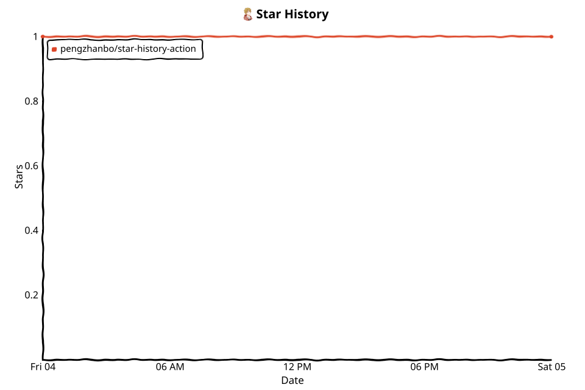

# star-history-action

[English](README.md) | 简体中文

一个 GitHub Action，用于获取仓库的 star 历史，并将 xkcd 风格的 SVG 图表提交回仓库。

## 快速开始

将 action 添加到工作流中。以下示例会定时刷新图表，并在每次推送到 `main` 时刷新：

```yaml
name: Update star history

on:
  schedule:
    - cron: '0 0 * * *' # daily
  workflow_dispatch:

jobs:
  update:
    runs-on: ubuntu-latest
    permissions:
      contents: write
    steps:
      - uses: actions/checkout@v4
      - uses: pengzhanbo/star-history-action@v1
        with:
          repo: pengzhanbo/star-history-action
          token: ${{ github.token }}
```

## 输入参数

<!-- markdownlint-disable MD060 -->

| 名称               | 必填 | 默认值                     | 说明                                                                                                                                         |
| ------------------ | ---- | -------------------------- | -------------------------------------------------------------------------------------------------------------------------------------------- |
| `repo`             | 否   | `${{ github.repository }}` | 要绘制图表的仓库，例如 `pengzhanbo/star-history-action`。                                                                                    |
| `token`            | 否   | `${{ github.token }}`      | 对目标仓库具有读取权限的 GitHub token。对于私有仓库或 GHES 目标，请使用 PAT。                                                                |
| `output-directory` | 否   | `assets`                   | 图表的输出目录，相对于工作区根目录。                                                                                                         |
| `output-filename`  | 否   | `star-history.svg`         | 输出文件名。必须以 `.svg` 结尾。当配置了两种主题时，会在扩展名之前追加 `-light`/`-dark`。                                                    |
| `svg-width`        | 否   | `960`                      | 生成的 SVG 宽度（像素）；高度为宽度的 2/3。                                                                                                  |
| `theme`            | 否   | `light`                    | 图表主题：`light`、`dark`，或用逗号/空格分隔的 `light, dark` 以同时输出两种主题。                                                            |
| `output-format`    | 否   | `svg`                      | 输出文件格式：`svg`（默认）、`png`（由 SVG 栅格化）、`both`，或 `json`（导出结构化记录数据而非图表）。                                       |
| `radar`            | 否   | `false`                    | 是否同时为每个仓库渲染一份雷达图 SVG，展示仓库健康指标（stars、new stars、pushes、contributors、issues closed、forks），各项均按 0–99 计分。 |

<!-- markdownlint-enable MD060 -->

## 行为说明

- **数据来源**：GitHub REST API（支持 `GITHUB_API_URL`，因此 GitHub Enterprise 实例同样可用）。
- **历史保真度**：最多抓取 15 页。历史记录在该预算内（约 1,500 颗 star）的仓库，会得到精确的逐日数据序列；更大的仓库会在均匀分布的边界点采样（每个点与真实数量的偏差在 ±100 颗 star 以内）。
- **渲染**：手绘风格的 xkcd 线条图，xkcd 字体以内联方式嵌入，因此 SVG 可在任何地方独立渲染。
- **提交与推送**：图表以 `github-actions[bot]` 身份提交，并推送到默认远程仓库的当前分支。重复运行时若无任何变更，则跳过提交，因此工作流是幂等的。在 `pull_request` 事件中会完全跳过写回——分叉的 PR 无法使用默认 token 推送，且图表不属于功能分支。
- **输出格式**：默认为 SVG——`output-filename` 必须以 `.svg` 结尾。当 `output-format` 为 `png` 或 `both` 时，图表会通过 resvg 栅格化为 PNG（`.png` 文件名与 `.svg` 对应，例如 `star-history-light.png`）。resvg 会从动作自带的 `assets/xkcd.ttf` 加载 xkcd 字体，因此 PNG 的文字样式与 SVG 一致，而不会回退到系统字体；随后再经 sharp 调色板量化，体积可缩减约 65% 且输出与原始渲染逐像素一致。
- **雷达图**：当 `radar: true` 时，会在历史图表之外为每个仓库写入一份雷达图 SVG，并与历史图表一样按主题各输出一份——单仓库单主题时为 `<stem>-radar.svg`；多仓库追加 `<owner>-<repo>`，双主题时在扩展名前插入 `-light`/`-dark`（例如 `star-history-radar-owner-repo-dark.svg`）。六项指标（stars、30 天内的 new stars、pushes、contributors、issues closed、forks）从 GitHub API 抓取，并按对数刻度映射为 0–99 分，因此雷达图比较的是指标强度而非原始数量。xkcd 字体以内联的 woff2 子集形式嵌入（与历史图表相同）。雷达图的输出遵循与历史图表相同的 `output-format` 规则：`png`/`both` 模式下会按主题/仓库栅格化出 PNG 孪生文件（雷达图原生 400×400 尺寸），SVG 与 PNG 一并随历史图表提交。
- **JSON 导出**：当 `output-format: json` 时不会渲染任何图表，而是将抓取的记录写入 `star-history.json`（`output-filename` 的主干名加上 `.json` 扩展名），结构为 `{ updatedAt, repos: [{ repo, records, radar? }] }`——`records` 是按日期升序的 `{ date, stars }` 序列，`radar` 在 `radar: true` 时保存 0–99 分的雷达得分。JSON 与主题无关（不派生 `-light`/`-dark` 变体），所有仓库的数据汇总到一个文件中，便于下游工具消费（badge、自定义前端、数据归档）。
- **部分成功**：当对比多个仓库时，某个仓库抓取失败（404、限流、无 star）只会以 warning 记录并跳过该仓库，而不会导致整个运行失败——其余仓库照常出图并提交。仅当所有仓库都失败时运行才失败。

## 在 README 中嵌入图表

生成的 SVG 是独立的——xkcd 字体已内联——因此它可以在任何地方渲染，包括你自己仓库的 GitHub README。

**单主题**：使用相对于仓库根目录的路径引用图表：

```markdown

```

**双主题**（`theme: light, dark`）：action 会写入两个文件——`star-history-light.svg` 和 `star-history-dark.svg`。使用 `<picture>` 元素，根据访客的配色方案自动切换图表：

```markdown
<picture>
  <source
    media="(prefers-color-scheme: dark)"
    srcset="assets/star-history-dark.svg"
  >
  
</picture>
```

注意事项：

- 如果修改了 `output-directory` 或 `output-filename`，请相应调整路径（单主题时文件保留输入文件名；双主题时会在扩展名之前插入 `-light`/`-dark`）。
- 相对路径基于 README 所在分支的仓库根目录解析。工作流会提交并推送图表，因此运行完成后图片即会更新。
- 如果 README 位于子目录中，请在相对路径前添加 `../`。
- `alt` 文本可保证图表可访问，并在图片无法加载时显示。

## 开发

```bash
pnpm install
pnpm lint   # oxlint（type-aware）+ oxfmt 检查
pnpm build  # tsdown → dist/index.js
pnpm test --run  # vitest，包括一次封闭式端到端运行
```

`dist/index.js` 已提交，因此 composite action 可以在安装生产依赖后运行 `node dist/index.js`。

## 许可证

MIT
